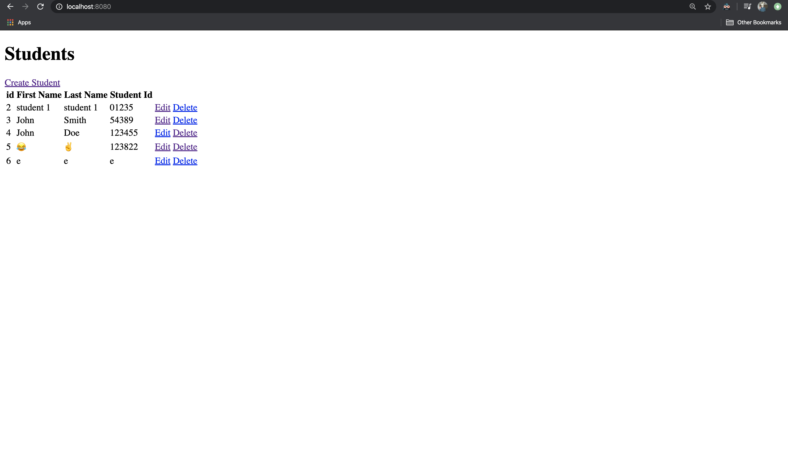

# Spring Boot App
Demo app in spring boot using MVC to manage the CRUD operations for student object.

## Starter
start.spring.io

Dependencies:
- Spring Web
- Thymeleaf
- Spring Data JPA
- MySQL Driver

## MySQL db
```
Table: student

Columns:
	id
	first_name
	last_name
	emp_id
```

## Run
Run `ByuhTestApplication.java` as java application

## End Result

